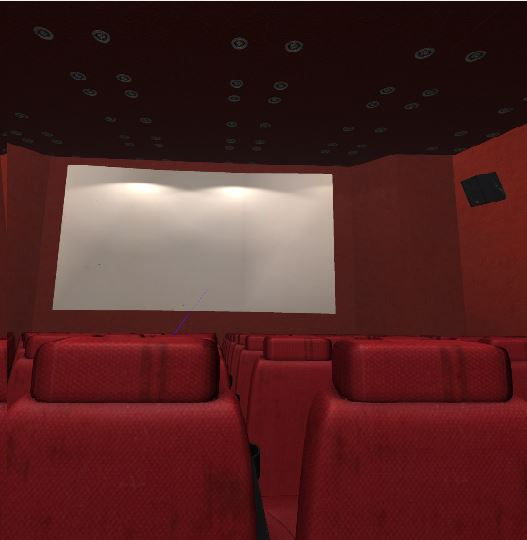

# Rotational-Drift
Virtual Reality environment to test user sensitivity to rotational drift while watching videos

Puts users in a virtual movie theater and randomly assigns thems to different sets of movie lengths and speeds 
and asks questions after each video.

The movie theaters

Playing the first movie

Participant can respond to questions, these are filler questions
